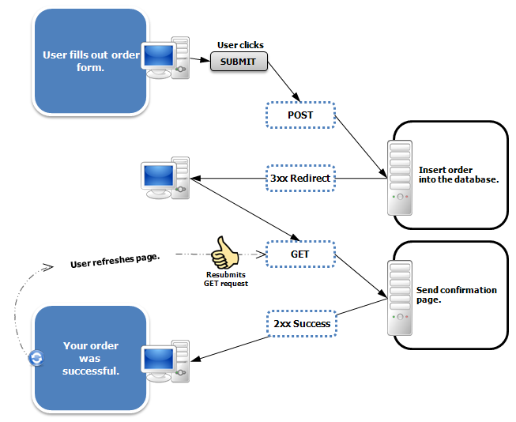

## PRG 패턴

## PRG 패턴 은 Post/Redirect/Get 패턴의 약자로, 웹 애플리케이션에서 폼 제출 후 페이지 새로 고침이나 브라우저 뒤로 가기 등의 문제를 방지하기 위해 사용하는 디자인 패턴입니다. 

- 폼을 서버로 post 요청을 보냄 -> 서버는 post 처리 후 클라이언트에 새로운 url로 리다이렉션 응답을 보냄 -> 클라이언트에 302 Fount 상태코드와 함깨 redirect수행
-> 클라이언트는 서버에 응답을 받아 새로운 url로 get요청을 보냄
